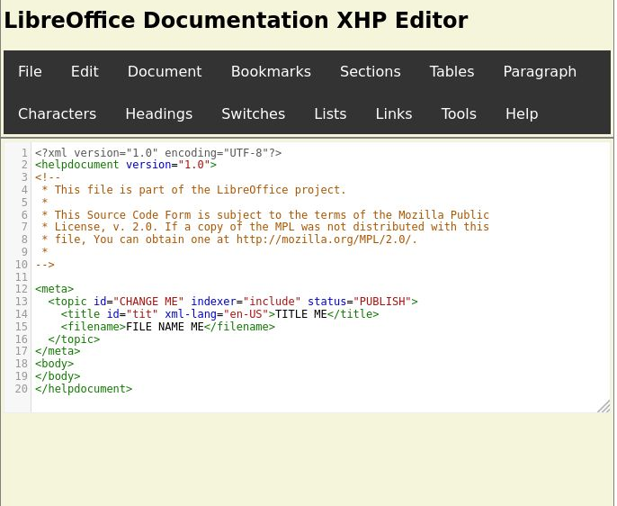
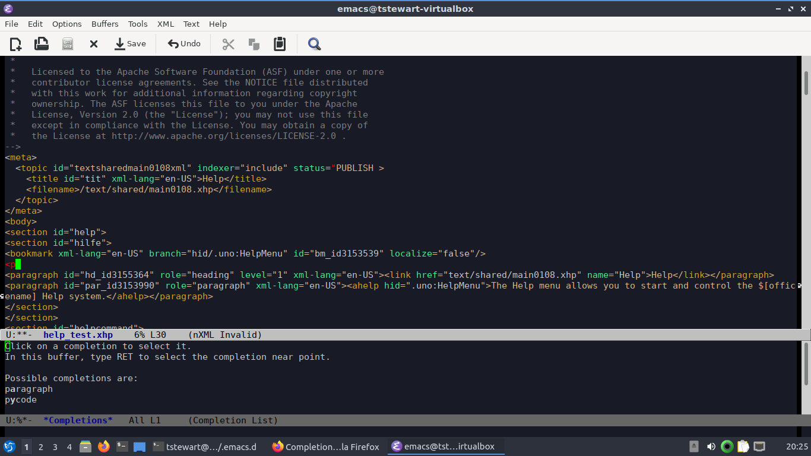
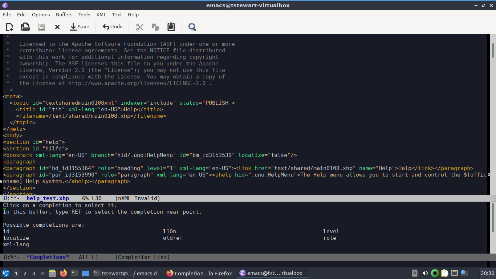

# Getting started with LibreOffice Help Docs

**September 14, 2020**

I recently joined the LibreOffice documentation team. After looking at the documention, I decided that I wanted to work on the [online help](https://help.libreoffice.org/). It my first stop whenever I need help because I can find quick answers to solve a specific problem. But another factor was the [big list of undocumented features](https://bugs.documentfoundation.org/showdependencytree.cgi?id=80430&hide_resolved=1). There aren't that many people working on the help documents, so I think I can make a real contribution there.

Why don't writers work on online help? I think the file format creates a barrier. LibreOffice uses XHP files to create online help pages. It is an XML format that originally defined pages for the in-application help system, but now it gets rendered into HTML. This lets them use the existing help pages, but it complicates the life of new writers. You need to know the format before you can write online help content. Even if you know the format you'll probably forget tags and make mistakes.

To make it easier, LibreOffice developed the [LibreOffice Documentation XHP Editor](https://newdesign.libreoffice.org/xhpeditor/index.php). It validates the XML and features autocomplete, which makes it a lot easier to write help pages. It is really nice.



But there is a major problem with the editor - **it isn't Emacs**. I admit it, I'm a bit stuck in my ways. I have been using Emacs for 20 years, my fingers know how to make it do things. So the question I needed to answer was "can I recreate the LibreOffice Documentation XHP Editor in Emacs?"

My initial investigation lead me to nXML mode, a major mode for editing XML in Emacs. It looked perfect since it supports real-time XML validation and XML completion. However, nXML needs a RELAX NG Compact Syntax (RNC) schema for the XML format to do its magic, and LibreOffice doesn't have one for XHP. Luckily they have a Document Type Definition (DTD). You can convert a DTD into an RNC schema with the `trang` tool.

`trang -Idtd -Ornc xmlhelp.dtd xmlhelp.rnc`

The `-I` option specifies the input type and `-O` specifies the output type. The third argument is the input DTD file and the fourth is the output file.

Now I needed to set up nXML to use the schema for XHP files. I copied the RNC schema to my `.emacs.d` directory and created a new file to store the rule for XHP schemas, `schemas.xml`, which I also saved in the same directory. This rule tells nXML to use the `xmlhelp.rnc` schema for any file with a `.xhp` extension.

```
<locatingRules xmlns="http://thaiopensource.com/ns/locating-rules/1.0">
    <uri pattern="*.xhp" uri="xmlhelp.rnc"/>
</locatingRules>
```

Finally, I set the Emacs variable `rng-schema-locating-files` in Emacs to `~/.emacs.d/schemas.xml`, which told nXML to look for schema rules in the file.

When typing, I just have to press `C-M-i` to get a list of possible completions. This works for elements and their attributes.





When the document fails XML validation the invalid part is highlighted (in this case, using red text), and if you move your cursor or mouse over the highlighted text, it describes the error.


That wasn't too difficult to do, and I'm able to work in my preferred environment while getting some of the same benefits of the LibreOffice XHP editor. The main thing this solution lacks is rendering. Right now I'm not able to render the XHP file in Emacs or the web browser. I might investigate that in the future, but for now I just need to start writing help pages.
